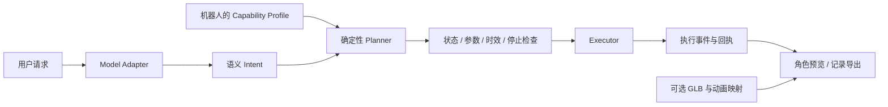

# Cowcoming Harness

把用户意图、AI 决策、机器人能力和角色表现分开。用同一套运行协议，先在浏览器里预演，再接入自己的机器人。

**开箱即用：不需要 API Key、机械臂、GLB 或模型权重。** 内置角色由代码生成，默认决策来源是明确标注的固定规则。真实 AI 与 BenBen 均为可选接入。

```bash
git clone https://github.com/ericshang98/cowcoming-harness.git
cd cowcoming-harness
# Node.js 24
npm ci
npm run dev
```

打开终端给出的 `http://127.0.0.1:4186/`。端口被占用时可以用 `HARNESS_PORT=4187 npm run dev`，不会结束已有服务。

## 可以直接试什么

1. 输入“请点一下头”：查看意图、计划、软件执行事件和独立的 3D 播放记录。
2. 把“动作能力”切到挥手机器人：相同的确认意图映射到 `arm_wave`；跳舞会明确显示不支持。
3. 切换“仅查看 AI 决策”：只生成计划，不播放动画或驱动设备。
4. 导入自己的单文件 GLB，把其动画片段绑定到能力 ID。文件只在浏览器内读取，不上传。
5. 编辑 JSON 能力配置、停止本轮、恢复新请求、导出完整记录。

`npm run build` 生成可放到任意静态主机的 `dist/`。静态版提供纯浏览器示例；服务器配置、云端密钥、真实 AI 和硬件入口只在本地服务里可用。

## 模块如何分工



| 模块              | 负责什么                                   | 替换方式                                                          |
| ----------------- | ------------------------------------------ | ----------------------------------------------------------------- |
| 决策模型          | 文本 → 语义意图                            | Mock、JEV、Laya、Ollama、兼容 Chat Completions 的服务、函数适配器 |
| 能力配置          | 本机支持哪些动作、参数和语义               | 替换 JSON profile，不限定全局五动作                               |
| Planner / Runtime | 精确映射、校验、去重、超时、停止、执行记录 | 保持公共协议                                                      |
| Executor          | 执行实际支持的动作，返回证据               | 软件执行器、记录执行器、自定义设备驱动、BenBen 适配器             |
| 角色资源          | GLB、动画片段、视觉映射                    | 换资源和映射，不改 AI 或串口代码                                  |

五项回应只属于 `benben-five-servo` 示例。`simulator` 有七项，`waving-robot` 只有一项；三者共用相同 runtime。v0.1 执行单步 `express` 意图；连续跟随、语音和多步任务还没有实现，收到这些意图会拒绝，不能据此宣称已有能力。

## 模型和资源要不要放进 Git

代码仓库不附带大模型权重、第三方角色或视频。请分别管理：

- **AI 权重**：选择已有模型服务或用户自行部署的本地模型。发布自训模型时，单独发布模型卡、训练/推理代码、许可证、固定版本及校验值；较大权重可托管在模型仓库。这里没有自训权重，也不声称提供了训练数据。
- **3D 资源**：默认程序生成角色已经能演示完整流程。自有 GLB 可独立发布为资源包，记录许可证、作者、版本、SHA-256 和动画名称；应用按需导入，clone 不下载全部角色。
- **实机配置**：公开能力与接口合同；个人串口、密钥、标定值保存在各自机器。JSON 声明动作不会自动创造驱动或使动作获得实机验收。

参见 [模型接入](docs/models.md)、[添加机器人与角色](docs/extending.md)、[BenBen 接入](docs/benben.md)、[运行协议与边界](docs/protocol.md)。

## 开发与验证

```bash
npm test                  # Node 合同、运行、模型适配、HTTP 边界
npm run test:bridge       # Python 假控制器测试，不驱动机械臂
npm run demo              # 无等待的记录执行器示例
npm run sandbox           # 只生成意图和计划
npm run build
# 可选浏览器验收：先 npx playwright install chromium，再 npm run qa
```

在 Cowcoming 主仓库中同样可用：`npm run harness:dev`、`npm run test:harness`、`npm run build:harness`。本目录可以独立检出，不依赖网站的素材或私有包。

Apache-2.0 只覆盖本仓库原创代码及程序生成示例；用户导入的角色、第三方模型和 BenBen 仓库各自遵循其许可证。参见 [LICENSE](LICENSE) 与 [第三方说明](THIRD_PARTY_NOTICES.md)。贡献流程见 [CONTRIBUTING.md](CONTRIBUTING.md)。

**English:** A modular intent-to-capability runtime for characters and robots. Run the local lab without keys, weights, or hardware; bring your own model endpoint, robot executor, and GLB. Simulation, timed device commands, and measured physical feedback remain distinct. This release is a software integration baseline, not a validated robotics controller.
